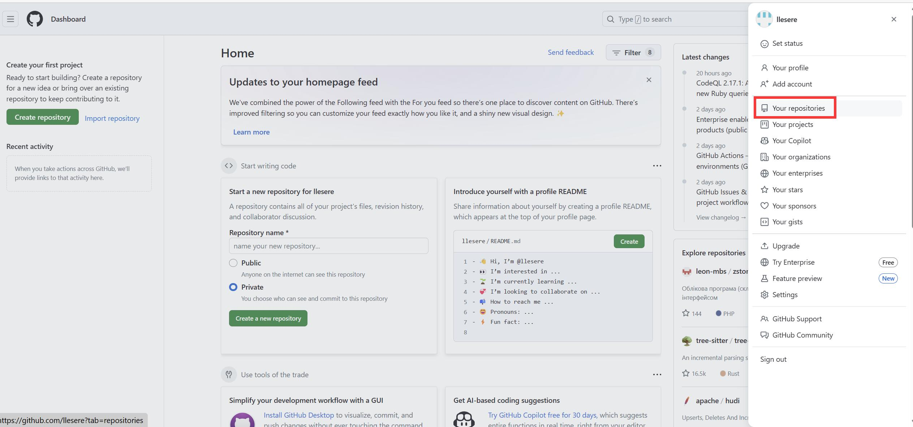
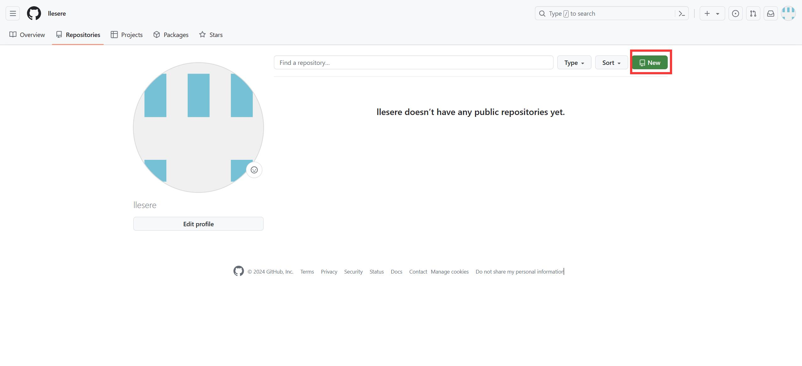
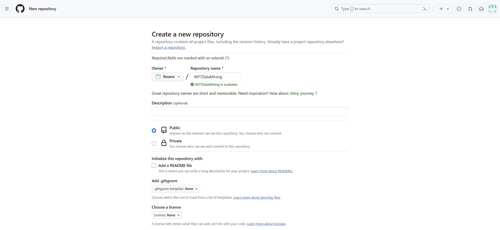
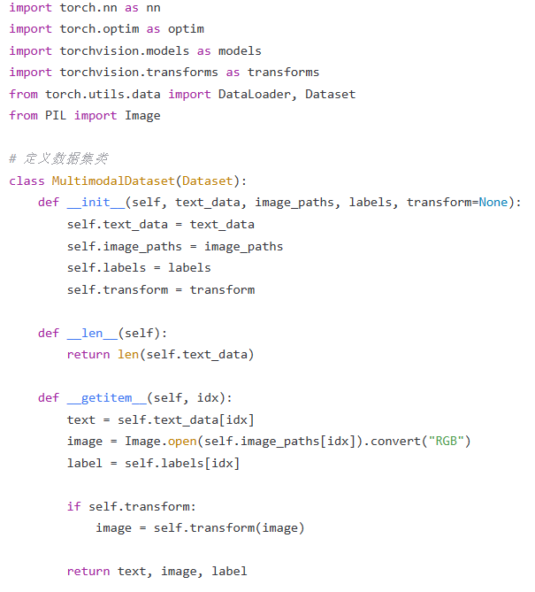
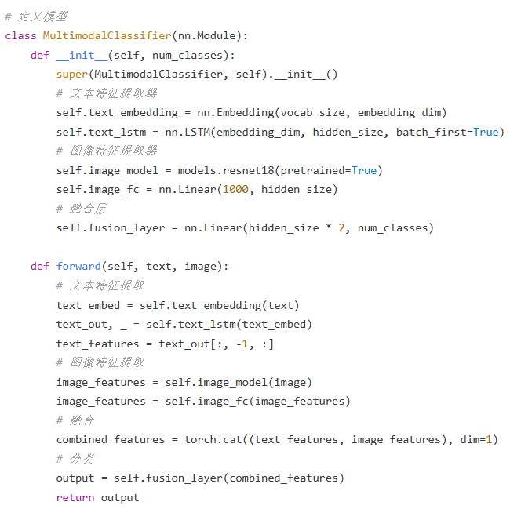
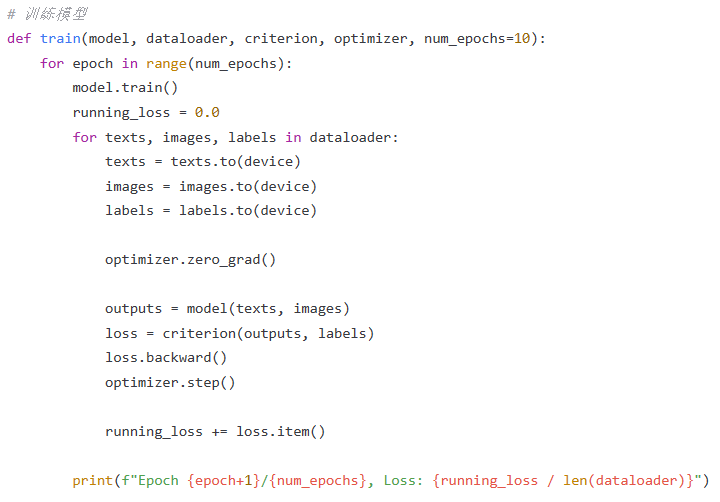
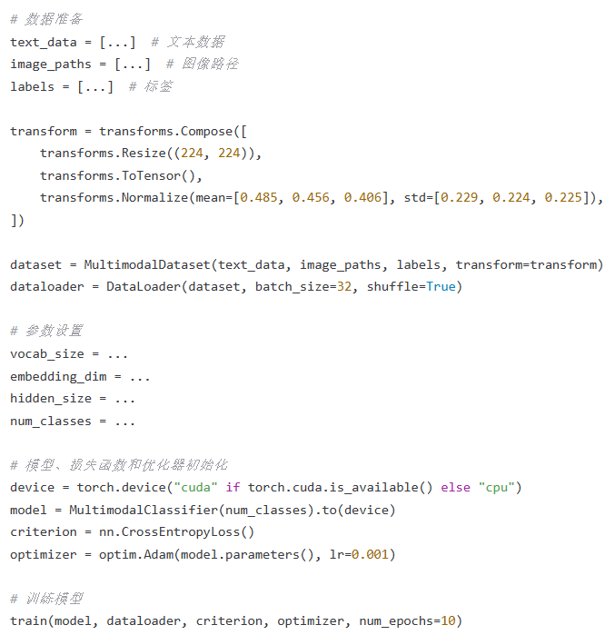

**
GitHub 上传作业流程
**

Github 仓库地址：https://github.com/llesere/WYTDataMining

因为我有 Github 账号，所以我直接如图一所示方式登录。

登录后进入个人主页 Dashboard，点击右上角个人头像展开右侧边栏。然后如图二所示点击 Your repositories。

进入 Repositories 页面后如图三点击右上角绿色 New 按钮进入创建库，如图四所示编辑库名称为 WYTDataMining，权限设置为 Public,可选填入描述，因为要将本文件作为 README 文件，因此不勾选添加一个 README 文件初始化此库。因为此库不存放代码文件，因此不需要 Git 版本控制系统忽略（不跟踪）指定的文件或文件夹所以.gitignore 模板和 license 为 None。最后点击 Create Repositories。

**1.背景介绍**

多模态学习和多任务学习是深度学习领域的两个热门话题，它们都有助于提高模型的性能和泛化能力。在本文中，我们将深入了解 PyTorch 中的多模态学习和多任务学习，揭示它们的核心概念、算法原理、实践技巧以及实际应用场景。

1.1 多模态学习

多模态学习是指同时处理多种不同类型的数据，如图像、文本、音频等。这种方法可以帮助模型更好地理解和捕捉数据之间的关联和依赖关系，从而提高模型的性能。例如，在计算机视觉领域，多模态学习可以将图像和文本信息融合，以提高对象识别和场景理解的准确性。

1.2 多任务学习

多任务学习是指同时训练多个相关任务的学习模型，以共享和传播知识，从而提高整体性能。这种方法可以帮助模型更好地捕捉共同特征，减少过拟合，提高泛化能力。例如，在自然语言处理领域，多任务学习可以将词嵌入、命名实体识别、情感分析等任务共同训练，以提高词嵌入的表达能力。

**2. 核心概念与联系**

2.1 多模态学习与多任务学习的区别

多模态学习和多任务学习在一定程度上有相似之处，但也有很大的区别。多模态学习关注于处理多种不同类型的数据，而多任务学习关注于同时训练多个相关任务。多模态学习通常需要处理不同类型的数据表示，而多任务学习则需要处理相同类型的数据表示。

2.2 多模态学习与多任务学习的联系

多模态学习和多任务学习在某种程度上可以相互联系。例如，在计算机视觉领域，可以将多模态学习与多任务学习结合，同时处理图像、文本和音频数据，并同时训练多个任务，如对象识别、场景理解和语音识别等。这种结合可以帮助模型更好地理解和捕捉数据之间的关联和依赖关系，从而提高模型的性能。

**3. 核心算法原理和具体操作步骤**

3.1 多模态学习的算法原理

多模态学习通常涉及到将多种不同类型的数据表示融合到一个共同的模型中，以提高模型的性能。这种融合可以通过多种方式实现，如：

特征级融合：将不同类型的数据表示映射到同一空间，并进行特征级融合。
模型级融合：将不同类型的数据表示映射到同一空间，并使用不同的模型进行融合。

3.2 多任务学习的算法原理

多任务学习通常涉及到同时训练多个相关任务的学习模型，以共享和传播知识，从而提高整体性能。这种训练可以通过多种方式实现，如：

共享权重：将多个任务的模型共享相同的权重，以实现知识传播。
任务特定权重：为每个任务分配独立的权重，并使用任务特定的损失函数进行训练。

3.3 具体操作步骤

3.3.1 多模态学习的具体操作步骤

数据预处理：将不同类型的数据进行预处理，以便于后续融合。
特征映射：将不同类型的数据映射到同一空间，以便于融合。
融合：对映射后的特征进行融合，以生成融合后的特征表示。
模型训练：使用融合后的特征表示训练模型。

3.3.2 多任务学习的具体操作步骤

数据预处理：将多个任务的数据进行预处理，以便于后续训练。
共享权重：为多个任务分配共享的权重，以实现知识传播。
任务特定损失函数：为每个任务分配独立的损失函数，以衡量模型的性能。
模型训练：使用共享权重和任务特定损失函数进行模型训练。

**4. 实际应用场景**

4.1 多模态学习的应用场景

计算机视觉：将图像和文本信息融合，以提高对象识别和场景理解的准确性。
自然语言处理：将词嵌入、命名实体识别、情感分析等任务共同训练，以提高词嵌入的表达能力。
语音识别：将音频和文本信息融合，以提高语音识别的准确性。

4.2 多任务学习的应用场景

自然语言处理：同时训练词嵌入、命名实体识别、情感分析等任务，以提高词嵌入的表达能力。
计算机视觉：同时训练对象识别、场景理解和语音识别等任务，以提高对象识别和场景理解的准确性。
机器翻译：同时训练词嵌入、命名实体识别和语法分析等任务，以提高翻译质量。

**5. 总结：未来发展趋势与挑战**

多模态学习和多任务学习是深度学习领域的两个热门话题，它们有助于提高模型的性能和泛化能力。在未来，我们可以期待这两个领域的进一步发展，例如：

更高效的多模态融合方法：将多种不同类型的数据表示融合到一个共同的模型中，以提高模型的性能。

更智能的多任务学习方法：同时训练多个相关任务的学习模型，以共享和传播知识，从而提高整体性能。

更广泛的应用场景：将多模态学习和多任务学习应用到更多的领域，例如自然语言处理、计算机视觉、语音识别等。

然而，多模态学习和多任务学习也面临着一些挑战，例如：

数据不均衡：多模态学习和多任务学习需要处理多种不同类型的数据，这可能导致数据不均衡，从而影响模型性能。

模型复杂性：多模态学习和多任务学习需要处理更复杂的模型，这可能导致计算成本和训练时间增加。

知识传播：多任务学习需要实现知识传播，这可能导致模型性能不均衡，从而影响整体性能。

**6. 常见问题**

6.1 问题 1：多模态学习与多任务学习的区别是什么？

回复：多模态学习关注于处理多种不同类型的数据，而多任务学习关注于同时训练多个相关任务。多模态学习通常需要处理不同类型的数据表示，而多任务学习则需要处理相同类型的数据表示。

6.2 问题 2：多模态学习和多任务学习有什么联系？

回复：多模态学习和多任务学习在某种程度上可以相互联系。例如，在计算机视觉领域，可以将多模态学习与多任务学习结合，同时处理图像、文本和音频数据，并同时训练多个任务，如对象识别、场景理解和语音识别等。这种结合可以帮助模型更好地理解和捕捉数据之间的关联和依赖关系，从而提高模型的性能。

6.3 问题 3：多模态学习和多任务学习有什么应用场景？

回复：多模态学习和多任务学习有很多应用场景，例如：
计算机视觉：将图像和文本信息融合，以提高对象识别和场景理解的准确性。
自然语言处理：将词嵌入、命名实体识别、情感分析等任务共同训练，以提高词嵌入的表达能力。
语音识别：将音频和文本信息融合，以提高语音识别的准确性。
机器翻译：将词嵌入、命名实体识别和语法分析等任务共同训练，以提高翻译质量。

**7. 演示**

这个示例中，我们结合了文本和图像两种模态，使用了一个简单的多模态融合方法（简单的拼接操作），然后使用一个简单的多模态分类器进行情感分类任务的训练。

