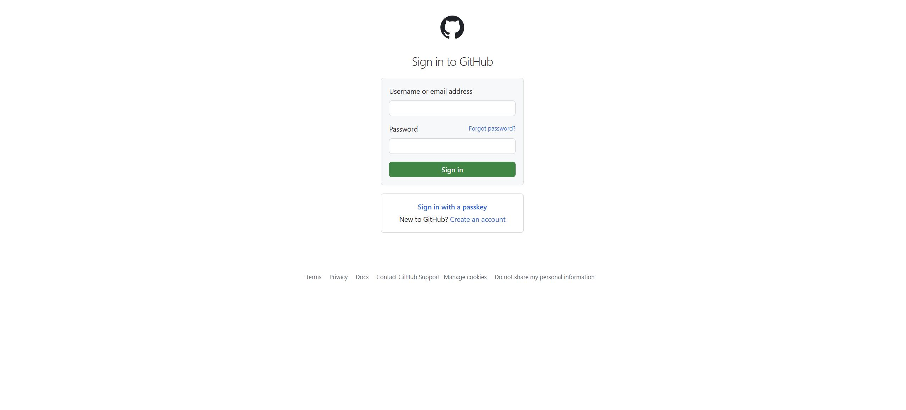
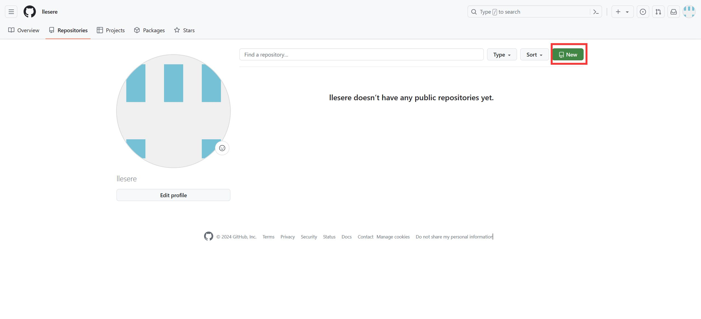
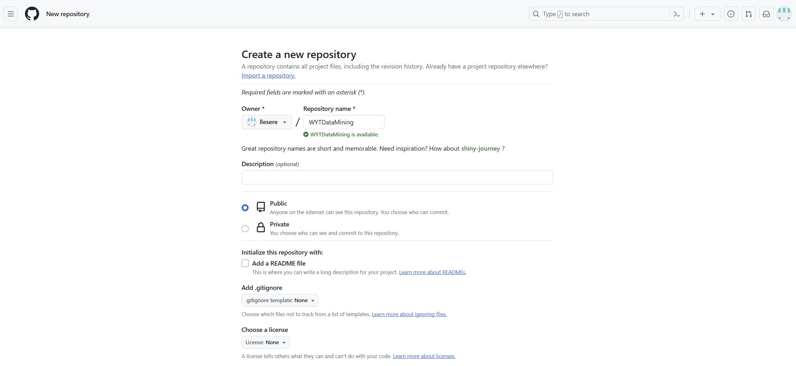

**GitHub 上传作业流程**

&emsp;&emsp;因为我有 Github 账号，所以我直接如图一所示方式登录。登录后进入个人主页 Dashboard，点击右上角个人头像展开右侧边栏。

&emsp;&emsp;然后如图二所示点击 Your repositories。进入 Repositories 页面后如图三点击右上角绿色 New 按钮进入创建库。

&emsp;&emsp;如图四所示编辑库名称为 WYTDataMining，权限设置为 Public,可选填入描述，因为要将本文件作为 README 文件，因此不勾选添加一个 README 文件初始化此库。因为此库不存放代码文件，因此不需要 Git 版本控制系统忽略（不跟踪）指定的文件或文件夹所以.gitignore 模板和 license 为 None。最后点击 Create Repositories。

**想要学习的问题：**

1. 在多模态交互中，如何确保不同感官输入的协调和一致性？

2. 对于语音识别技术，如何解决不同语音口音和语言的识别问题？

3. 在图像识别方面，如何应对复杂场景下的物体检测和识别挑战？

4. 对于手势识别技术，如何避免误判和提高准确率？
5. 在虚拟现实和增强现实中，如何实现对真实世界的高度还原和与虚拟环境的无缝融合？

6. 在触摸和手势输入方面，如何设计用户界面和交互方式以提高用户的操作便利性和体验？

7. 对于多模态交互的安全性和隐私保护，有哪些技术和措施可以采取？

8. 在多模态交互的设计中，如何平衡用户需求和系统性能的要求？

9. 对于残障人士，如何利用多模态交互技术提供更加普适和友好的使用体验？

10. 未来多模态交互的发展趋势和应用前景是什么？
